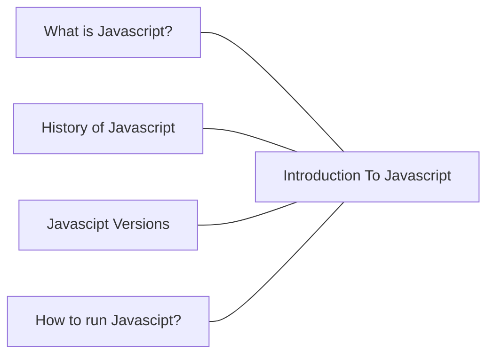

# Introduction to Javascript

## Overview.



- [Introduction to Javascript](#introduction-to-javascript)
  - [what is Javascript?](#what-is-javascript)
  - [History of Javascript.](#history-of-javascript)
  - [Javascript Versions.](#javascript-versions)
  - [How to run Javascript?](#how-to-run-javascript)

For more Free Content on Variables Visit


# What is Javascript?
# History of Javascript.
Around 10 years ago, Jeff Atwood (the founder of stackoverflow) made a case that JavaScript is going to be the future and he coined the “Atwood Law” which states that Any application that can be written in JavaScript will eventually be written in JavaScript. Fast-forward to today, 10 years later, if you look at it it rings truer than ever. JavaScript is continuing to gain more and more adoption.


## JavaScript is announced
JavaScript was initially created by [Brendan Eich](https://twitter.com/BrendanEich) of NetScape and was first announced in a press release by Netscape in 1995. It has a bizarre history of naming; initally it was named `Mocha` by the creator, which was later renamed to `LiveScript`. In 1996, about a year later after the release, NetScape decided to rename it to be `JavaScript` with hopes of capitalizing on the Java community (although JavaScript did not have any relationship with Java) and released Netscape 2.0 with the official support of JavaScript.


## ES1, ES2 and ES3
In 1996, Netscape decided to submit it to [ECMA International](https://en.wikipedia.org/wiki/Ecma_International) with the hopes of getting it standardized. First edition of the standard specification was released in 1997 and the language was standardized. After the initial release, `ECMAScript` was continued to be worked upon and in no-time two more versions were released ECMAScript 2 in 1998 and ECMAScript 3 in 1999.


## Decade of Silence and ES4
After the release of ES3 in 1999, there was a complete silence for a decade and no changes were made to the official standard. There was some work on the fourth edition in the initial days; some of the features that were being discussed included classes, modules, static typings, destructuring etc. It was being targeted to be released by 2008 but was abandoned due to political differences concerning language complexity. However, the vendors kept introducing the extensions to the language and the developers were left scratching their heads — adding polyfills to battle compatibility issues between different browsers.

## From silence to ES5
Google, Microsoft, Yahoo and other disputers of ES4 came together and decided to work on a less ambitious update to ES3 tentatively named ES3.1. But the teams were still fighting about what to include from ES4 and what not. Finally, in 2009 ES5 was released mainly focusing on fixing the compatibility and security issues etc. But there wasn’t much of a splash in the water — it took ages for the vendors to incorporate the standards and many developers were still using ES3 without being aware of the “modern” standards.

## Release of ES6 — ECMAScript 2015
After a few years of the release of ES5, things started to change, TC39 (the committee under ECMA international responsible for ECMAScript standardization) kept working on the next version of ECMAScript (ES6) which was originally named ES Harmony, before being eventually released with the name ES2015. ES2015 adds significant features and syntactic sugar to allow writing complex applications. Some of the features that ES6 has to offer, include Classes, Modules, Arrows, Enhanced object literals, Template strings, Destructuring, Default param values + rest + spread, Let and Const, Iterators + for..of, Generators, Maps + Sets, Proxies, Symbols, Promises, math + number + string + array + object APIs [etc](http://es6-features.org/#Constants)

Browser support for ES6 is still scarce but everything that ES6 has to offer is still available to developers by transpiling the ES6 code to ES5. With the release of 6th version of ECMAScript, TC39 decided to move to yearly model of releasing updates to ECMAScript so to make sure that the new features are added as soon as they are approved and we don’t have to wait for the full specification to be drafted and approved — thus 6th version of ECMAScript was renamed as ECMAScript 2015 or ES2015 before the release in June 2015. And the next versions of ECMAScript were decided to published in June of every year.


## Release of ES7 — ECMAScript 2016
In June 2016, seventh version of ECMAScript was released. As ECMAScript has been moved to an yearly release model, ECMAScript 2016 (ES2016) comparatively did not have much to offer. ES2016 includes just two new features

- Exponentiation operator `**`
- `Array.prototype.includes`

## What is ESNext then?
ESNext is a dynamic name that refers to whatever the current version of ECMAScript is at the given time. For example, at the time of this writing `ES2017` or `ES8` is `ESNext`.

## What does the future hold?
Since the release of ES6, [TC39](https://github.com/tc39) has quite streamlined their process. TC39 operates through a Github organization now and there are [several proposals](https://github.com/tc39/proposals) for new features or syntax to be added to the next versions of ECMAScript. Any one can go ahead and [submit a proposal](https://github.com/tc39/proposals) thus resulting in increasing the participation from the community. Every proposal goes through [four stages of maturity](https://tc39.es/process-document/) before it makes it into the specification.

And that about wraps it up. Feel free to leave your feedback in the comments section below. Also here are the links to original language specifications [ES6](https://262.ecma-international.org/6.0/), [ES7](https://262.ecma-international.org/7.0/) and [ES8](https://262.ecma-international.org/8.0/).


**For more Free History Javascipt follow the Links**

- [History of JS](https://dev.to/iarchitsharma/the-history-of-javascript-5e98)

# Javascript Versions.
# How to run Javascript?
## Requirements

No prior knowledge of programming is required to follow this challenge. You need only:

1. Motivation
2. A computer
3. Internet
4. A browser
5. A code editor

## Setup

I believe you have the motivation and a strong desire to be a developer, a computer and Internet. If you have those, then you have everything to get started.

### Install Node.js

You may not need Node.js right now but you may need it for later. Install [node.js](https://nodejs.org/en/).


After downloading double click and install


We can check if node is installed on our local machine by opening our device terminal or command prompt.

```sh
asabeneh $ node -v
v12.14.0
```

When making this tutorial I was using Node version 12.14.0, but now the recommended version of Node.js for download is v14.17.6, by the time you use this material you may have a higher Node.js version.

### Browser

There are many browsers out there. However, I strongly recommend Google Chrome.

#### Installing Google Chrome

Install [Google Chrome](https://www.google.com/chrome/) if you do not have one yet. We can write small JavaScript code on the browser console, but we do not use the browser console to develop applications.


#### Opening Google Chrome Console

You can open Google Chrome console either by clicking three dots at the top right corner of the browser, selecting _More tools -> Developer tools_ or using a keyboard shortcut. I prefer using shortcuts.


To open the Chrome console using a keyboard shortcut.

```sh
Mac
Command+Option+J

Windows/Linux:
Ctl+Shift+J
```


After you open the Google Chrome console, try to explore the marked buttons. We will spend most of the time on the Console. The Console is the place where your JavaScript code goes. The Google Console V8 engine changes your JavaScript code to machine code.
Let us write a JavaScript code on the Google Chrome console:


#### Writing Code on Browser Console

We can write any JavaScript code on the Google console or any browser console. However, for this challenge, we only focus on Google Chrome console. Open the console using:

```sh
Mac
Command+Option+I

Windows:
Ctl+Shift+I
```

##### Console.log

To write our first JavaScript code, we used a built-in function **console.log()**. We passed an argument as input data, and the function displays the output. We passed `'Hello, World'` as input data or argument in the console.log() function.

```js
console.log('Hello, World!')
```

##### Console.log with Multiple Arguments

The **`console.log()`** function can take multiple parameters separated by commas. The syntax looks like as follows:**`console.log(param1, param2, param3)`**


```js
console.log('Hello', 'World', '!')
console.log('HAPPY', 'NEW', 'YEAR', 2020)
console.log('Welcome', 'to', 30, 'Days', 'Of', 'JavaScript')
```

As you can see from the snippet code above, _`console.log()`_ can take multiple arguments.

Congratulations! You wrote your first JavaScript code using _`console.log()`_.

##### Comments

We can add comments to our code. Comments are very important to make code more readable and to leave remarks in our code. JavaScript does not execute the comment part of our code. In JavaScript, any text line starting with // in JavaScript is a comment, and anything enclosed like this `//` is also a comment.

**Example: Single Line Comment**

```js
// This is the first comment  
// This is the second comment  
// I am a single line comment
```

**Example: Multiline Comment**

```js
/*
This is a multiline comment  
 Multiline comments can take multiple lines  
 JavaScript is the language of the web  
 */
```

##### Syntax

Programming languages are similar to human languages. English or many other language uses words, phrases, sentences, compound sentences and other more to convey a meaningful message. The English meaning of syntax is _the arrangement of words and phrases to create well-formed sentences in a language_. The technical definition of syntax is the structure of statements in a computer language. Programming languages have syntax. JavaScript is a programming language and like other programming languages it has its own syntax. If we do not write a syntax that JavaScript understands, it will raise different types of errors. We will explore different kinds of JavaScript errors later. For now, let us see syntax errors.


I made a deliberate mistake. As a result, the console raises syntax errors. Actually, the syntax is very informative. It informs what type of mistake was made. By reading the error feedback guideline, we can correct the syntax and fix the problem. The process of identifying and removing errors from a program is called debugging. Let us fix the errors:

```js
console.log('Hello, World!')
console.log('Hello, World!')
```

So far, we saw how to display text using the _`console.log()`_. If we are printing text or string using _`console.log()`_, the text has to be inside the single quotes, double quotes, or a backtick.
**Example:**

```js
console.log('Hello, World!')
console.log("Hello, World!")
console.log(`Hello, World!`)
```

#### Arithmetics

Now, let us practice more writing JavaScript codes using _`console.log()`_ on Google Chrome console for number data types.
In addition to the text, we can also do mathematical calculations using JavaScript. Let us do the following simple calculations.
It is possible to write JavaScript code on Google Chrome console can directly without the **_`console.log()`_** function. However, it is included in this introduction because most of this challenge would be taking place in a text editor where the usage of the function would be mandatory. You can play around directly with instructions on the console.


```js
console.log(2 + 3) // Addition
console.log(3 - 2) // Subtraction
console.log(2 * 3) // Multiplication
console.log(3 / 2) // Division
console.log(3 % 2) // Modulus - finding remainder
console.log(3 ** 2) // Exponentiation 3 ** 2 == 3 * 3
```

### Code Editor

We can write our codes on the browser console, but it won't be for bigger projects. In a real working environment, developers use different code editors to write their codes. In this 30 days of JavaScript challenge, we will be using Visual Studio Code.

#### Installing Visual Studio Code

Visual Studio Code is a very popular open-source text editor. I would recommend to [download Visual Studio Code](https://code.visualstudio.com/), but if you are in favor of other editors, feel free to follow with what you have.


If you installed Visual Studio Code, let us start using it.

#### How to Use Visual Studio Code

Open the Visual Studio Code by double-clicking its icon. When you open it, you will get this kind of interface. Try to interact with the labeled icons.


## Adding JavaScript to a Web Page

JavaScript can be added to a web page in three different ways:

- **_Inline script_**
- **_Internal script_**
- **_External script_**
- **_Multiple External scripts_**

The following sections show different ways of adding JavaScript code to your web page.

### Inline Script

Create a project folder on your desktop or in any location, name it 30DaysOfJS and create an **_`index.html`_** file in the project folder. Then paste the following code and open it in a browser, for example [Chrome](https://www.google.com/chrome/).

```html
<!DOCTYPE html>
<html lang="en">
  <head>
    <title>30DaysOfScript:Inline Script</title>
  </head>
  <body>
    <button onclick="alert('Welcome to 30DaysOfJavaScript!')">Click Me</button>
  </body>
</html>
```

Now, you just wrote your first inline script. We can create a pop up alert message using the _`alert()`_ built-in function.

### Internal Script

The internal script can be written in the _`head`_ or the _`body`_, but it is preferred to put it on the body of the HTML document.
First, let us write on the head part of the page.

```html
<!DOCTYPE html>
<html lang="en">
  <head>
    <title>30DaysOfScript:Internal Script</title>
    <script>
      console.log('Welcome to 30DaysOfJavaScript')
    </script>
  </head>
  <body></body>
</html>
```

This is how we write an internal script most of the time. Writing the JavaScript code in the body section is the most preferred option. Open the browser console to see the output from the `console.log()`.

```html
<!DOCTYPE html>
<html lang="en">
  <head>
    <title>30DaysOfScript:Internal Script</title>
  </head>
  <body>
    <button onclick="alert('Welcome to 30DaysOfJavaScript!');">Click Me</button>
    <script>
      console.log('Welcome to 30DaysOfJavaScript')
    </script>
  </body>
</html>
```

Open the browser console to see the output from the `console.log()`.


### External Script

Similar to the internal script, the external script link can be on the header or body, but it is preferred to put it in the body.
First, we should create an external JavaScript file with .js extension. All files ending with .js extension are JavaScript files. Create a file named introduction.js inside your project directory and write the following code and link this .js file at the bottom of the body.

```js
console.log('Welcome to 30DaysOfJavaScript')
```

External scripts in the _head_:

```html
<!DOCTYPE html>
<html lang="en">
  <head>
    <title>30DaysOfJavaScript:External script</title>
    <script src="introduction.js"></script>
  </head>
  <body></body>
</html>
```

External scripts in the _body_:

```html
<!DOCTYPE html>
<html lang="en">
  <head>
    <title>30DaysOfJavaScript:External script</title>
  </head>
  <body>
    <!-- JavaScript external link could be in the header or in the body --> 
    <!-- Before the closing tag of the body is the recommended place to put the external JavaScript script -->
    <script src="introduction.js"></script>
  </body>
</html>
```

Open the browser console to see the output of the `console.log()`.

### Multiple External Scripts

We can also link multiple external JavaScript files to a web page.
Create a `helloworld.js` file inside the 30DaysOfJS folder and write the following code.

```js
console.log('Hello, World!')
```

```html
<!DOCTYPE html>
<html lang="en">
  <head>
    <title>Multiple External Scripts</title>
  </head>
  <body>
    <script src="./helloworld.js"></script>
    <script src="./introduction.js"></script>
  </body>
</html>
```

_Your main.js file should be below all other scripts_. It is very important to remember this.

