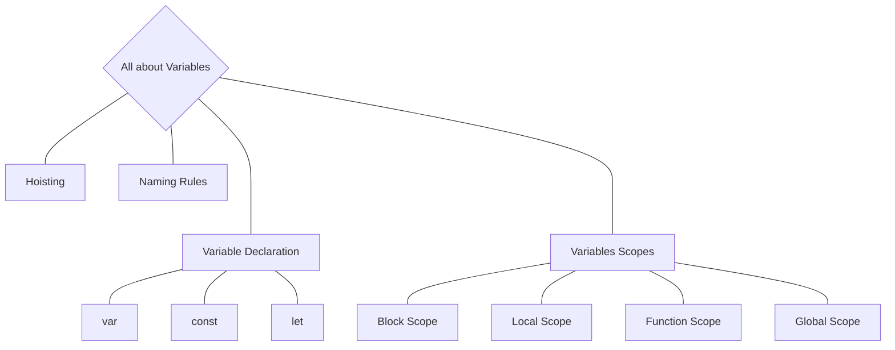

## Overview


- [Variables](#variables)
  - [Naming Rules](#naming-rules)
  - [Hoisting]()
  - [Variable Declaration]()
    - [var]()
    - [const]()
    - [let]()
  - [Variables Scopes]()
    - [Block Scopes]()
    - [Local Scopes]()
    - [Functional Scopes]()
    - [Global Scopes]()


For more Free Content on Variables Visit
- [Javascript Variables](https://javascript.info/variables)
- [Storing The information You need](https://developer.mozilla.org/en-US/docs/Learn/JavaScript/First_steps/Variables)
- [Understanding Variables in JS](https://www.informit.com/articles/article.aspx?p=131025&seqNum=3)
- [Naming JS Variables](https://www.dummies.com/article/technology/programming-web-design/javascript/naming-javascript-variables-142522/)
- [JavaScript Naming Conventions](https://www.robinwieruch.de/javascript-naming-conventions/)
- [Google JavaScript Style Guide](https://google.github.io/styleguide/jsguide.html)
- [What is Hoisting - MDN Docs](https://developer.mozilla.org/en-US/docs/Glossary/Hoisting)
- [JavaScript Hoisting](https://www.geeksforgeeks.org/javascript-hoisting/)
- [Storing the information you need — Variables](https://developer.mozilla.org/en-US/docs/Learn/JavaScript/First_steps/Variables)
- []()

      
# ***Variables***

Variables are containers for storing data (storing data values).

In this example, x, y, and z, are variables, declared with the var keyword:
```js
var x = 5;
var y = 6;
var z = x + y;
```
***The Assignment Operator***

In JavaScript, the equal sign (=) is an "assignment" operator, not an "equal to" operator.

This is different from algebra. The following does not make sense in algebra:
```js
x = x + 5
```
In JavaScript, however, it makes perfect sense: it assigns the value of x + 5 to x.

(It calculates the value of x + 5 and puts the result into x. The value of x is incremented by 5.)


**Note**

The "equal to" operator is written like == in JavaScript.


# Naming Rules

 1. Cannot be a reserved keyword.
 2. Should be meaningfull. 
      - Use Names(like : Interest_Rate) instead of Letters like (x,y,z).
      - This can prevent us having bugs in our projects.
 3. Variables cannot start with a number (1name).
 4. Cannot contain a space or a hyphen(-).
 5. Varialbles are Case-Sensitive.

