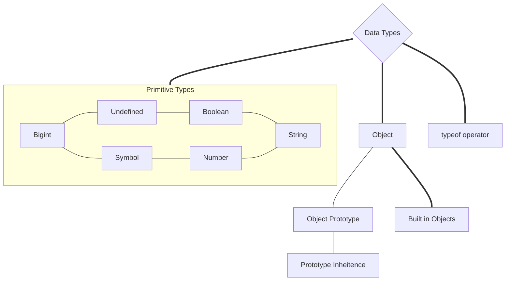

# Overview

# **Data Types**
In JavaScript and also other programming languages, there are different types of data types. The following are JavaScript primitive data types: _String, Number, Boolean, undefined, Null_, and _Symbol_.
# Primitive Types
## String
## Number
## Boolean
## Undefined
## Null
## Symbol
## Bigint