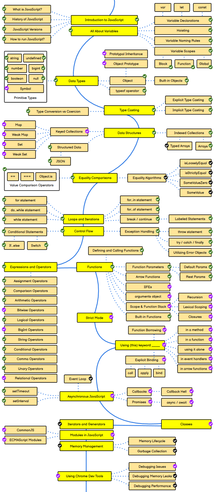

# JS Complete Notes:
These Notes are based on a [Roadmap](https://roadmap.sh/javascript) created by `@Kamranahmedse`. The Roadmap that he has shown on his website is very helpfull, because it's based on a flow chart. All the information, codes, Problems and Examples are in the Notes, but still if i've missed somethings and made some mistake please contribute. My Goal of making these Notes is to not miss a single point in Javascript and to save a lot of time from visiting diffrent websites that `@Kamranahmedse` has given on his website.All the Notes will be in `.md` Files and all the Problems and Examples that are in the `.md` file will be in the same folder for you to practice and learn.

- 📫 How to reach me **ihteshamulhaq510@gmail.com**

<h3 align="left">Connect with me:</h3>

<h3 align="left">Languages and Tools:</h3>

  

|    #    |            Description              |
|---------|-------------------------------------|
|    1    |                 [Introduction](./1_Introduction/Introduction.md#introduction-to-javascript)                    |
|    2    |                 [Variables](./2_Variables/Variables.md#variables)                    |
|    3    |                 [Data Types](./3_Data%20Types/Data%20Types.md)                    |
|    4    |                 [Type Casting](./4_Type%20Casting/Readme.md)                    |
|    5    |                 [Data structures](./5_Data%20Structures/Readme.md)                    |
|    6    |                 [Equality Comparison](./6_Equality%20Comparison/Readme.md)                    |
|    7    |                 [Loops and Iterations](./7_%20Loops%20and%20Iterations/Readme.md)                    |
|    8    |                 [Control Flow](./8_Control%20Flow/Readme.md)                    |
|    9    |                 [Expressions and Operators](./9_Expressions%20and%20Operators/Readme.md)                    |
|    10   |                 [Function](./10_Functions/Functions.md)                    |
|    11   |                 [Strict mode](./11_Strict%20Mode/Readme.md)                    |
|    12   |                 [Using (this) Keyword_____](./12_Using%20(this)%20keyword%20____/Readme.md)                    |
|    13   |                 [Asyncchronous Javascript](./13_Asynchronous%20JavaScript/Readme.md)                    |
|    14   |                 [Clsses](./14_Classes/Classes.md)                    |
|    15   |                 [Iterators and Generators](./15_Iterators%20and%20Generators/Readme.md)                    |
|    16   |                 [Modules in Javascript](./16_Modules%20in%20JavaScript/Readme.md)                    |
|    17   |                 [Memory Management](./17_Memory%20Management/Readme.md)                    |
|    18   |                 [Using chrome dev tools](./18_Using%20Chrome%20Dev%20Tools/Readme.md)                    |
